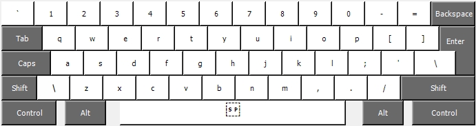
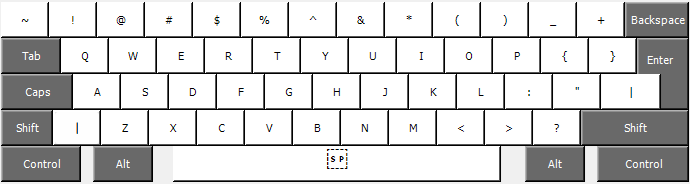
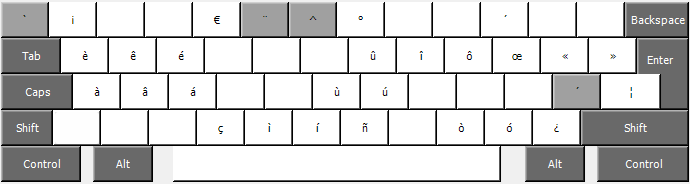
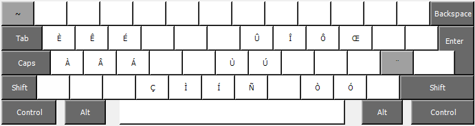

# My Keyboard Layout

This keyboard is based on the standard US layout, with added access to many useful symbols and accents via the AltGr key. Unlike the US international layout, it does not use dead keys outside of the AltGr context.

*Tested with [Windows 11](windows) and [Fedora KDE Plasma](xkb)*

## Preview

### Base layout (= standard US)

### Shift (= standard US)

### AltGr (custom layout)

### Shift + AltGr (custom layout)

